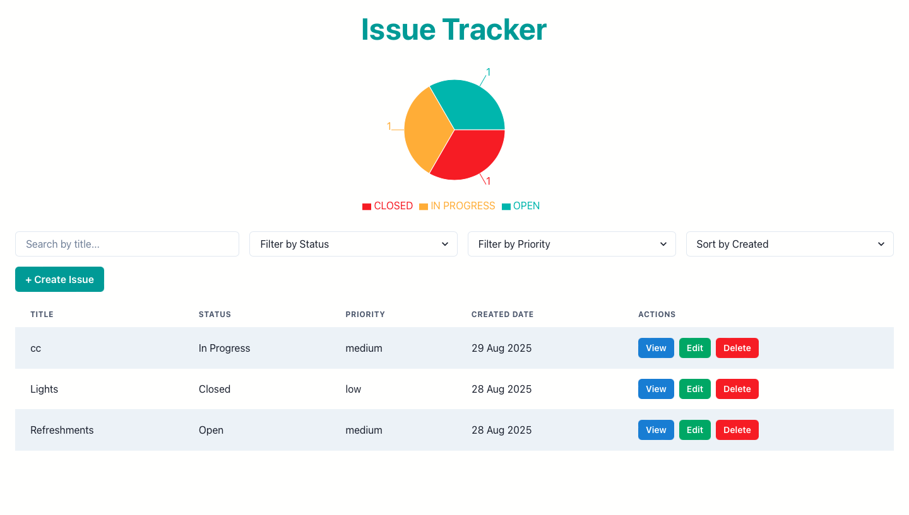

---
## Issue Tracker
A full-stack Issue tracker application built with FASTAPI (backend) and React (frontend).
The project allows users to create, view, update, delete, search, filter, and sort issues, while also visualizing issue statuses dynamically through charts.

---

## Features

### Backend (FastAPI)

- Restful API with CRUD operations for issues
- Input Validation using Pydantic
- Database integration with SQLAlchemy
- Filtering by status and priority
- Searching by title
- Sorting by creation date or priority
- API tested with Pytest
- Continous Integration with GitHub Actions

### Frontend (React)

- Responsive UI built with React
- State management with React hooks
- Create Issue form (Title, Description, Status, Priority)
- List of issues with filters and sorting
- Search bar for quick issue lookup
- Dynamic chart showing issues grouped by status
- CRUD operations fuly integrated with backend

---
## Live link

[Issue Tracker](https://issue-tracker-cx90.onrender.com)
---

## Author 
Sanele Skhosana